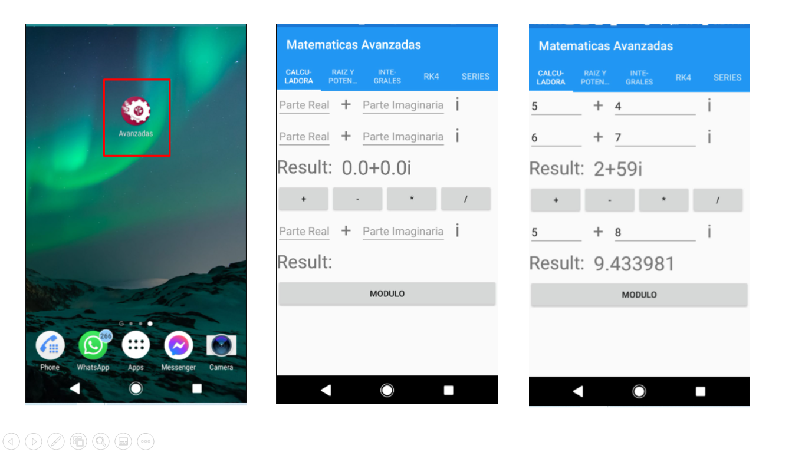
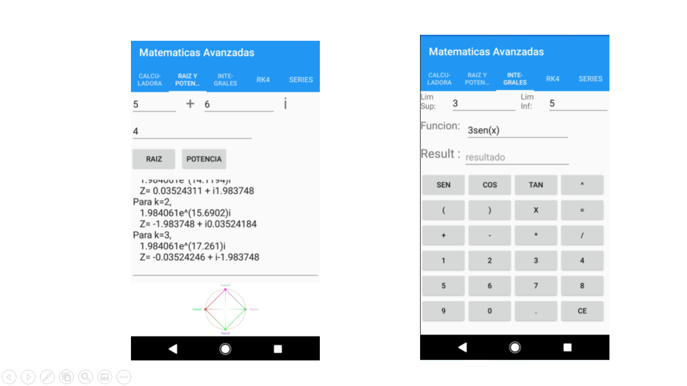
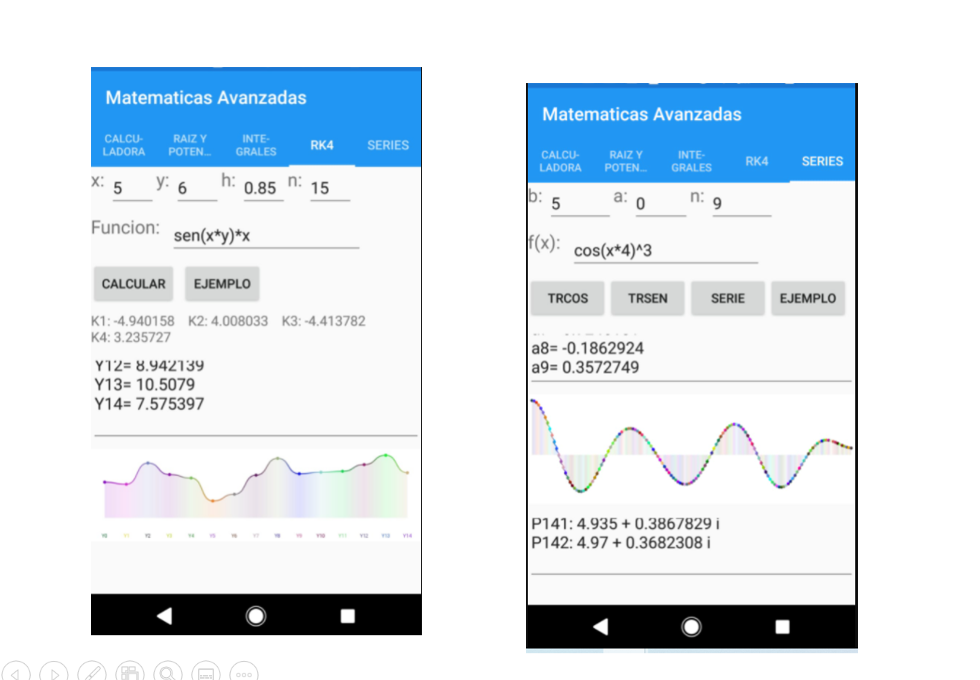

# Pagina Inventario

Proyecto escolar, aplicacion en Xamarin util para metodos numericos.

_Funciones_
* suma, resta, multiplicación y division de numeros complejos
* modulo de numeros complejos
* raiz y potencia de numeros complejos
* calculadora simple de integrales
* metodo numerio Runge Kuta (RK4)
* transformada seno, transformada coseno y serie de fourier

_Apariencia_




## Comenzando 🚀

- Descargar y descomprimir el proyecto

### Pre-requisitos 📋

_Necesario_

```
- Un dispositivo movil
- Visual Studio o Xamarin Studio. En caso de editar codigo
```

### Instalación 🔧

_Pasos para correr proyecto_

```
- Si tu dispositivo es android y no quieres modificar nada. Solo instala el apk
- Si tu dispositivo es iOS tendrás que compilar la aplicación
```

## Construido con 🛠️

_Para este proyecto se utilizó_

* [Xamarin](https://dotnet.microsoft.com/apps/xamarin)

## Autores ✒️

_Mencion a todos aquellos que ayudaron a levantar el proyecto desde sus inicios_

* **Alonso Alvarez** - *Codificacion* - [AlonsoAlvarez](https://github.com/AlonsoAlvarez)


---
⌨️ con ❤️ por [AlonsoAlvarez](https://github.com/AlonsoAlvarez) 😊

